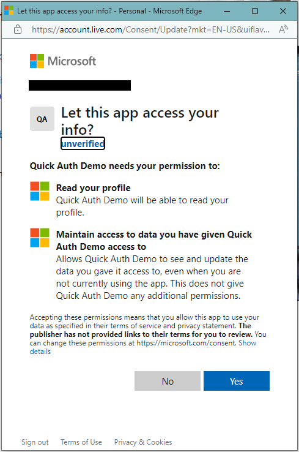
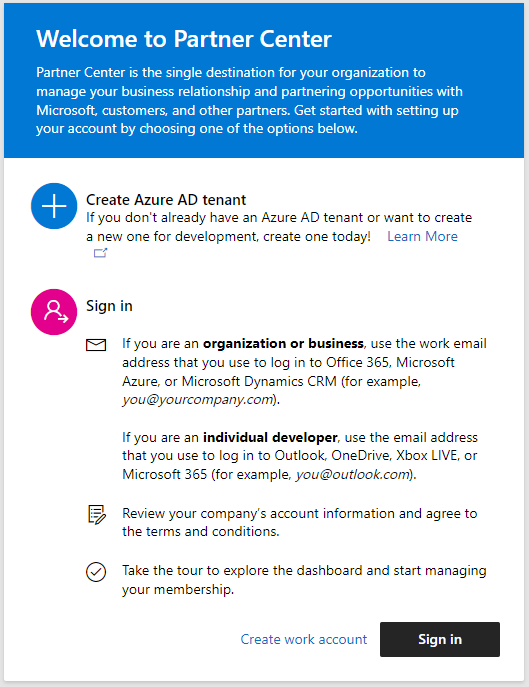
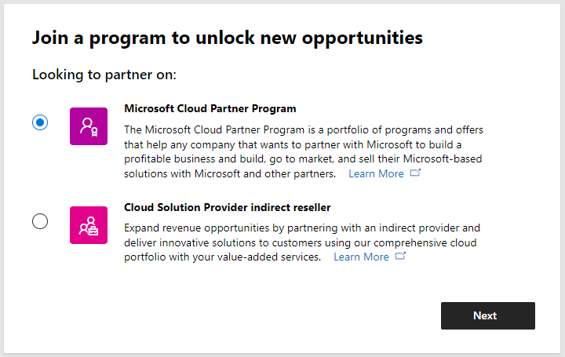
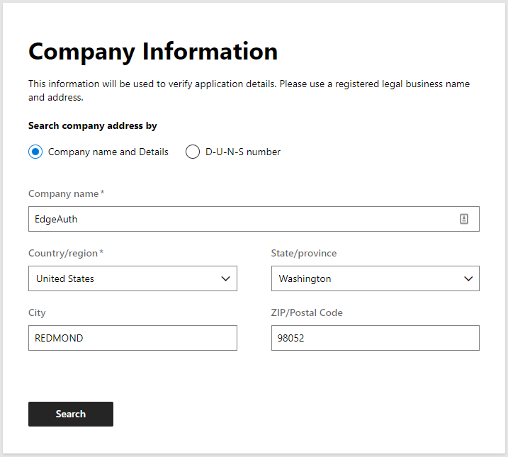
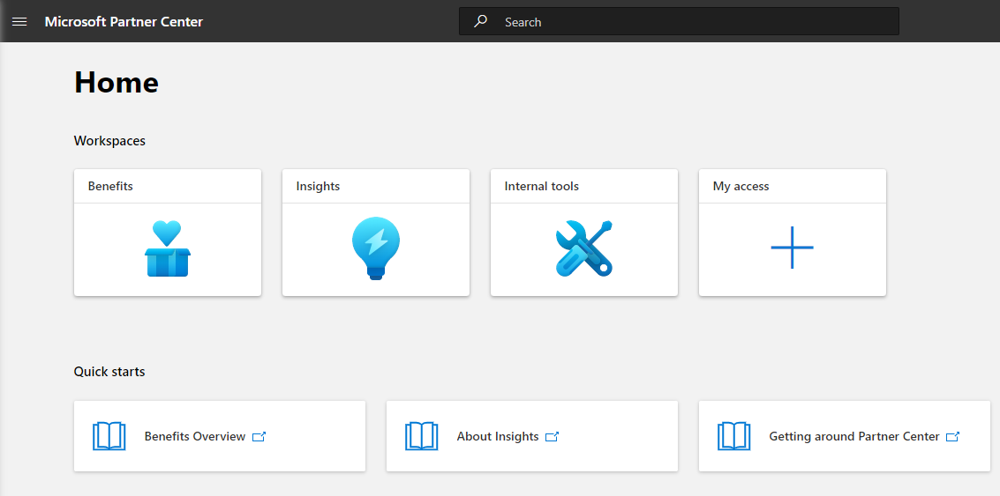
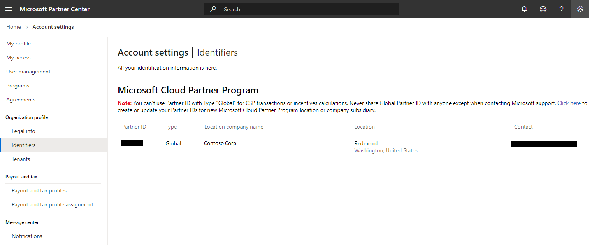
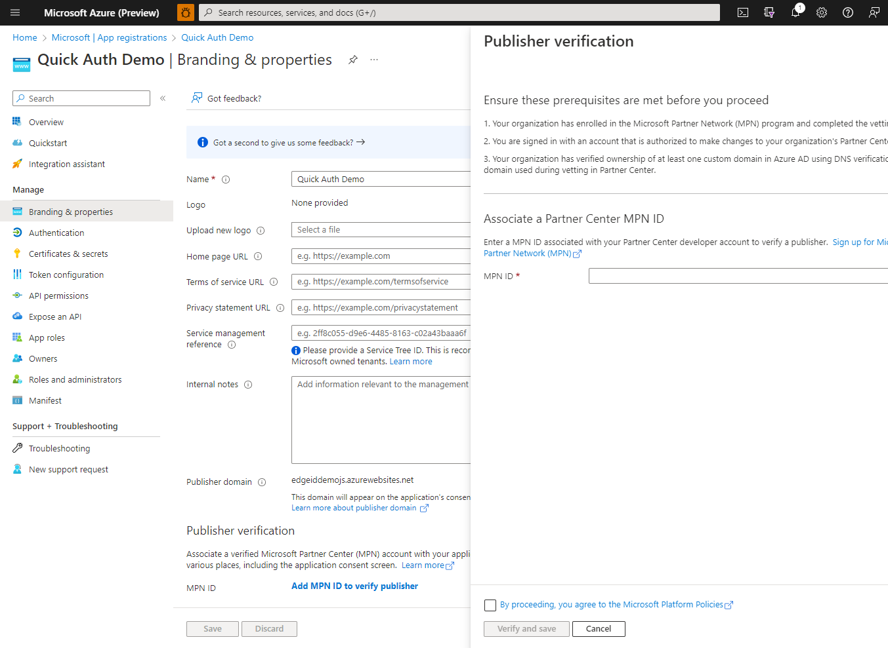

# Joining Partner Center and obtaining business verification

Joining the Partner Center and obtaining verification of your business by Microsoft will allow your website or app to show as a verified business in the user consent dialog and on [account.microsoft.com](https://account.live.com/consent/Manage). 

This not required for [Quick Authentication](../README.md) to work. If you do not wish to complete this process, Quick Authentication will still fully work, however the mention "unverified" will show in the consent dialog under "Let this app access your info?" and on [account.microsoft.com](https://account.live.com/consent/Manage).

Replacing the "unverified" mention by your company's name requires to complete three main steps:
1. If you do not have one already, create a new Azure AD tenant, associate that new tenant with your domain, and create an Admin user for that tenant.
3. Register to the Microsoft Partner Center (formely, Microsoft Partner Network) and get your business vefirified by Microsoft to obtain an MPN number
4. Associate the MPN number to your application registration in Azure.

## Creating a new Azure Active Directory tenant
To take advantage of business verification as a Microsoft partner, you will need to register your app in your tenant in Azure AD.

### Creating a new tenant
If your company does not already have one, you will need to create a new Azure ID tenant. To do that, follow the instructions here: [Create a new tenant in Azure Active Directory](https://learn.microsoft.com/en-us/azure/active-directory/fundamentals/active-directory-access-create-new-tenant). 

Once your tenant had been created, you can switch to it by using the [Manage Tenant](https://portal.azure.com/?feature.msaljs=false#view/Microsoft_AAD_IAM/DirectorySwitchBlade/subtitle/) page.

When you create a new Azure AD tenant, you become the first user of that tenant. As the first user, you're automatically assigned the Global Admin role. 

Azure also creates a new user with Global Admin role in a subdomain of `onmicrosoft.com`. You can check that out by navigating to the [Users](https://portal.azure.com/#blade/Microsoft_AAD_IAM/UsersManagementMenuBlade/MsGraphUsers) page. From here on, you can use either the original account, or this new user account to access your new tenant.

If your company already owns a tenant, you can use that one instead of creating a new one, as long as you have access to that tenant as a user with the Global Admin role. 

### Adding your domain name
Once your tenant is created, add your own domain name to it by following the steps on [Add your custom domain name using the Azure Active Directory portal](https://learn.microsoft.com/en-us/azure/active-directory/fundamentals/add-custom-domain). 

Note that this requires to add a TXT record to your domain with your domain registar, and that propagation of that information might take up to 3 days before you can verify that the domain has been added to your tenant in Azure AD.

To verify that your domain has fully propagated and is valid on Azure, refer back to [these steps](https://learn.microsoft.com/en-us/azure/active-directory/fundamentals/add-custom-domain#verify-your-custom-domain-name).

### Adding a new user
To join the Partner Center and obtain verification of your business, you will need a user in your custom domain and with the Global Admin role. Create such a user by following the instructions on [Add or delete users using Azure Active Directory](https://learn.microsoft.com/en-us/azure/active-directory/fundamentals/add-users-azure-active-directory). In step 4, when adding the new user, choose the custom domain you just added for the domain part of the user name.

Using that new user, sign-in to Azure portal. This will ensure that you go through any 2FA creation and fully create your user account.

## Enrolling in the Microsoft Cloud Partner Program and getting your business verified
The Microsoft Cloud Partner Program (formerly called the Microsoft Partner Network) is a hub of people, resources, and offerings brought together to give you everything you need to build and deliver successful solutions for your customers. Joining the Microsoft Could Partner Program gives you access to the Partner Center, where you can request verification of your business. 

First, double check prerequisites for enrolling on [What is the Microsoft Cloud Partner Program](https://learn.microsoft.com/en-us/partner-center/mpn-create-a-partner-center-account), then follow the enrollement instructions starting [here](https://partner.microsoft.com/en-us/dashboard/account/v3/enrollment/introduction/partnership). On the "Welcome to Partner Center" page, click "Sign in" and sign-in as the user you created above, for example, `somebody@contoso.org`

On the page titled "Join a program to unlock new opportunities", choose "Microsoft Cloud Partner Program" and click next. 

On the next screen, enter your company legal business details. The [What is the Microsoft Cloud Partner Program?](https://learn.microsoft.com/en-us/partner-center/mpn-create-a-partner-center-account) page provide additional help in the [Getting started](https://learn.microsoft.com/en-us/partner-center/mpn-create-a-partner-center-account#get-started) section. 

[This page](https://learn.microsoft.com/en-us/partner-center/verification-responses) provides additional details on what is verified by Microsoft and what to expect next. Verification can take up to 5 business days.

## Creating your application registration and associating it with an MPN number to attest of business verification

### Obtain the MPN ID
The Microsoft Partner Network ID (NPM ID), also called Partner ID, can be found by signing-in to the [Microsoft Partner Center dasboard](https://partner.microsoft.com/en-us/dashboard/home) as the Global Admin user you created in your own tenant in section [Add a new user](#adding-a-new-user). 

Click on "My Access" and then on "Identifiers" on the left of the following page:

The MPN ID, or Partner ID, is shown for your user. 

### Create your Azure AD app registration
In your company Azure AD tenant (i.e., go to the [Azure Portal](https://portal.azure.com) and sign-in with the tenant user you created above), create a registration for your website and/or apps as indicated in Quick Authentication [Getting Starting guide](./quick-authentication-how-to.md#register-your-application).

Make sure to create your app registration for "Personal Microsoft accounts only". You won't be able to change that once the app registration is created. In the first screen when you create the app registration, look for the following choices and make sure to check "Personal Microsoft accounts only":

### Enter the MPN ID in your app registration
Once you have created your app registration and have your MPN ID (a.k.a., Partner ID) obtained in section [Obtain the MPN ID](#obtain-the-mpn-id) handy, go to your new [app registration](https://ms.portal.azure.com/#view/Microsoft_AAD_IAM/ActiveDirectoryMenuBlade/~/RegisteredApps) in Azure AD, and click on "Branding & properties" on the left:

First, make sure that the Publisher domain is set to your custom domain and change it if not.

Then, click on "Add MPN ID to verify publisher". A panel titled "Publisher verification" will open up from the right in which you can enter the MPN ID and click "Verify and save". The verification might initially fail with the following error:

If you get this error, verify that:
1. The user you added in section [Adding a new user](#adding-a-new-user) and that you used to sign-in to your tenant with has the Global Administrator role, by going to your tenant page and clicking "Users" in the left pane.
2. The custom domain you added in section [Adding your domain name](#adding-your-domain-name) shows as verified, by going to your tenant page and clicking on "Custom domain names" in the left pane.

After checking the above, try verification again. If you get the same error, wait for a few hours and try again (the process of associating an MPN ID with an app registration can take some time). 

Once verification succeeded, you will notice that when using this new app registration's Client ID in your website or app, the "unverified" mention on the sharing consent screen and in other places such as on [accounts.live.com](https://account.live.com/consent/Manage?uaid=1a6b0f15cc3647ff8bb553c2733a1828&mkt=en-US&guat=1) has been replaced by your organization name along with a small badge of verification. 

